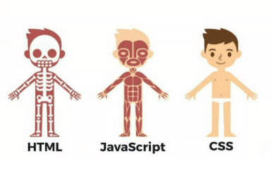

# A short Introduction

- [Github](https://www.github.com) account
- [W3Schools](https://www.w3schools.com/)
- Human Body
- Editor (VS Code | Sublime | Atom)

## Aufgaben
- [x] Html 1
- [x] Html 2
- [x] Html 3
- [x] Html 4
- [x] Html 5
- [x] CSS 1
- [x] CSS 2
- [x] CSS 3
- [x] CSS 4
- [ ] CSS 5
- [ ] JS 1
- [ ] JS 2
- [ ] JS 3
- [ ] JS 4
- [ ] JS 5

## HTML
- Hypertext Markup Language
- Minimal HTML Structure
- Meta Information
- Most Important Tags
- Chrome Dev Tools

## CSS

- Cascading Stylesheets
- How to include Styles? 🤔
- [Selectors](https://www.w3schools.com/cssref/css_selectors.asp)
- Demonstrate Cascading

## JavaScript
- JS Anwendungsbereiche
- Include Script
- Console Log
- Variables
- Manipulating DOM (HTML + CSS)
- Position Matters
- Functions

## Nice-To-Haves
- Html Static Site Generators (Jekyll, Gatsby, ...)
- CSS Transitions
- CSS Animations
- CSS Media Queries
- CSS Frameworks
- CSS Preprocessors (Sass)
- Github vertiefend
- JS Anwendungsbereiche vertiefend
- JS Frameworks
- Real World Examples
